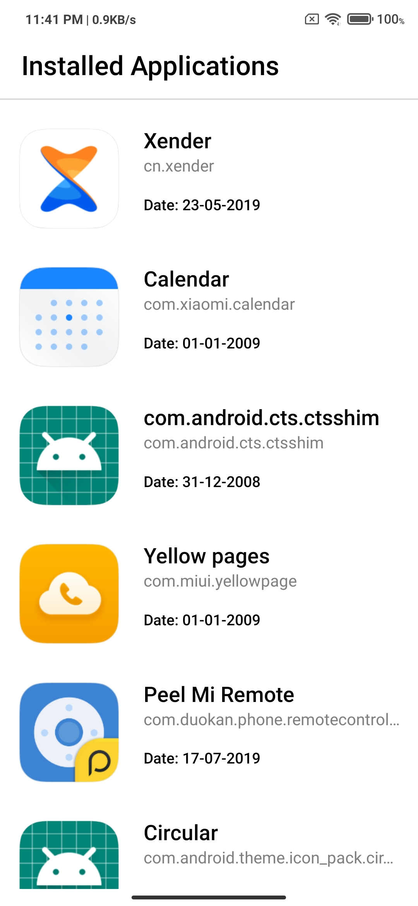

# rn-app

**Project Name**: `Installed Apps`

## About App

-  This app will show you all the app which installed in your android os (System and Non-System Apps) with package name and installed date.

## About implementation

-  I have implemented a native module for getting all installed app in java caled InstalledAppModule.

## How to Run the Project

1. Open the project directory in to terminal

2. Install all dependencies
   
   - Run below command

     npm install
   
2. Run and build for either OS

   - Run Android app
 
     npx react-native run-android

   - Note: Make sure you have already install node.js and react native on your machine.

## List of all dependencies used in the project with their usage

List all dependencies from the package.json file along with their usage. This list must be updated every time you change/add any dependecy. Here are some examples:

- **Framework:**

  - [react-native](https://github.com/facebook/react-native)
    [react](https://github.com/facebook/react)

- **Icons:**

  - [phosphor-react-native](https://github.com/duongdev/phosphor-react-native),

- **SVG Support:**

  - [react-native-svg](https://github.com/software-mansion/react-native-svg),

